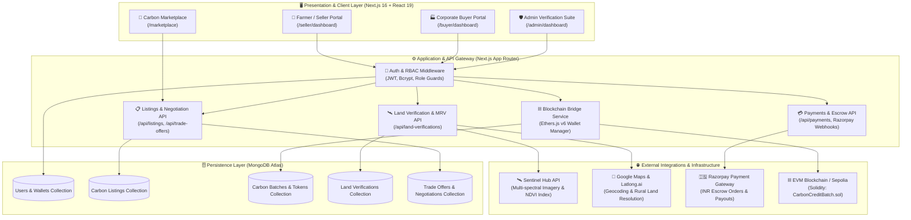
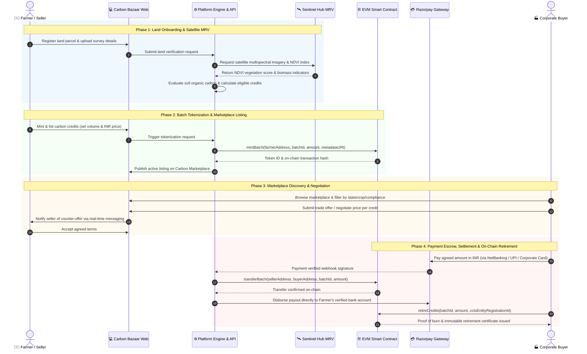
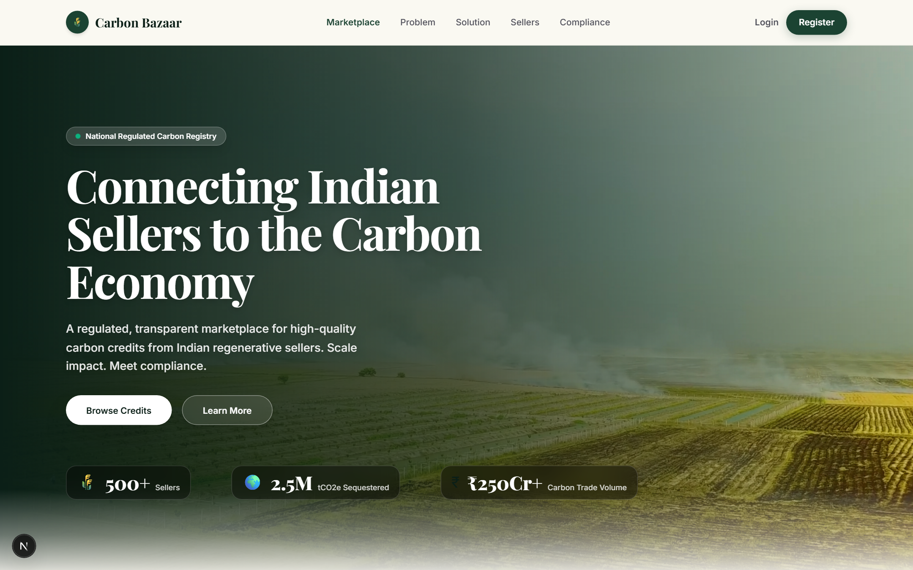
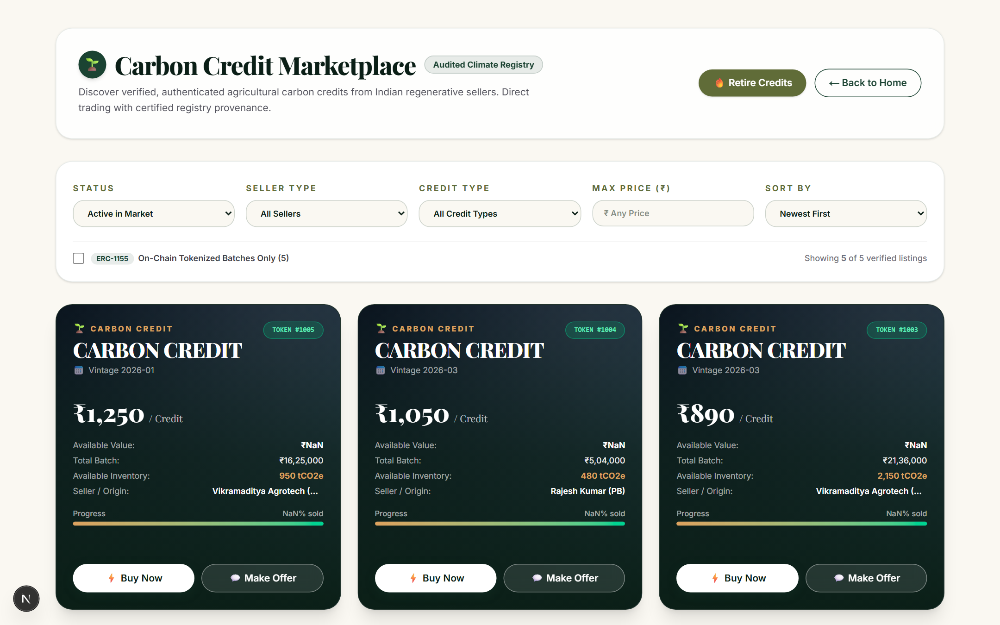
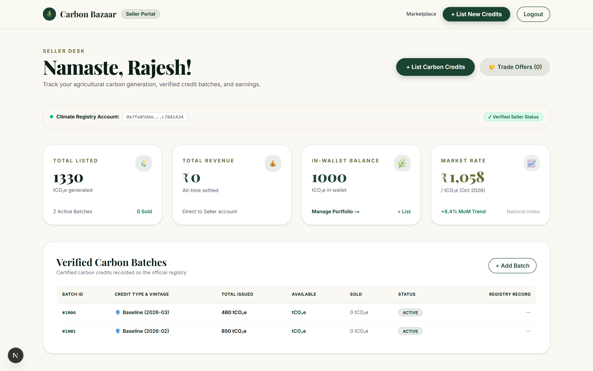
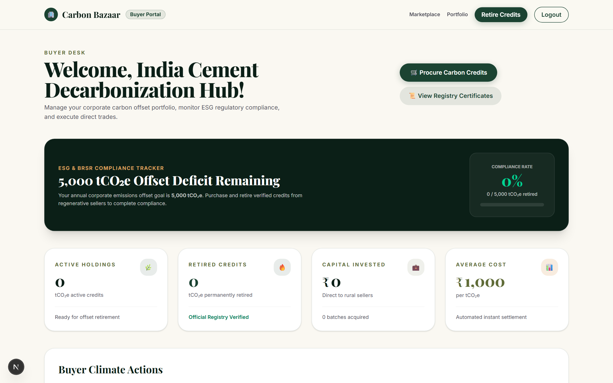
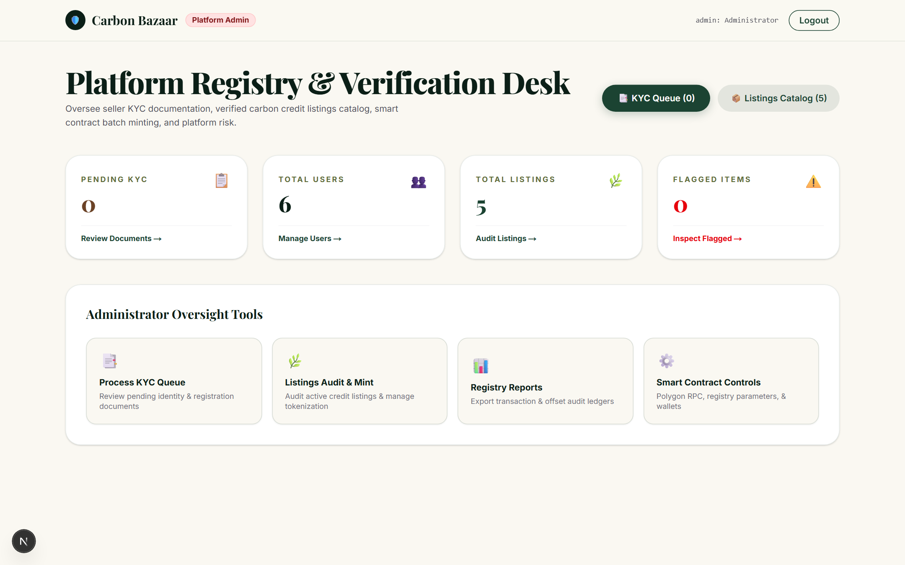
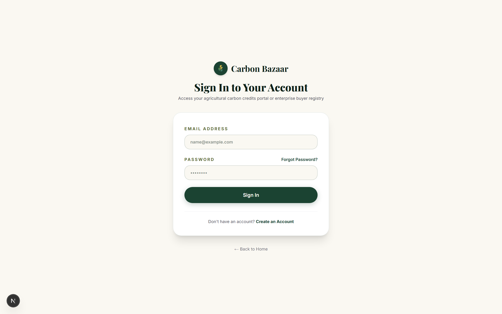
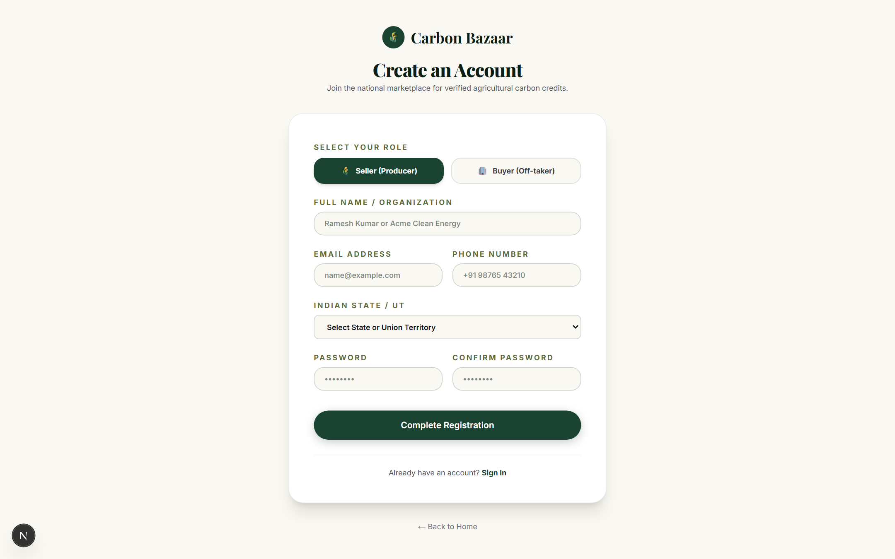

# 🌱 Carbon Bazaar

> **Where sustainable agricultural action meets corporate climate compliance.**  
> India's farmer-inclusive digital carbon credit marketplace built for the **Carbon Credit Trading Scheme (CCTS – 2026)**.

[](https://nextjs.org/)
[](https://react.dev/)
[](https://tailwindcss.com/)
[](https://soliditylang.org/)
[](https://hardhat.org/)
[](https://www.mongodb.com/)
[](https://razorpay.com/)

---

## 📌 Problem Statement

India is operationalizing its **Carbon Credit Trading Scheme (CCTS) by 2026**, covering over **800 industrial entities across 9 energy-intensive sectors** (including Iron & Steel, Cement, Pulp & Paper, Chlor-Alkali, Aluminum, and Thermal Power).

While corporate demand for compliant carbon offsets is projected to surge exponentially, **agriculture remains largely detached from the formal carbon economy**:
- **70%+ of Indian rural households** depend on agriculture, practicing sustainable techniques (reduced tillage, cover crops, biochar, alternate wetting & drying in paddy fields) without financial incentives.
- **Complex Verification Hurdles**: Existing voluntary carbon markets (VCS, Gold Standard) are prohibitively slow, expensive, and industry-oriented.
- **Intermediary Extraction**: Traditional carbon developers take up to 60-80% of credit value, leaving nominal returns to on-ground farmers.
- **Regulatory Gap**: Indian businesses need domestically verified, audit-ready carbon credits that adhere to Bureau of Energy Efficiency (BEE) mandates.

---

## 💡 The Carbon Bazaar Solution

**Carbon Bazaar** bridges this critical gap through a two-sided digital ecosystem powered by **Satellite Remote Sensing (MRV)**, **EVM Smart Contracts**, and **Direct Indian Banking (INR via Razorpay)**:
- **For Farmers & FPOs**: Turn climate-smart farming into direct secondary income with guided onboarding, satellite assessment, and transparent bank payouts.
- **For Regulated Businesses**: Source verified, domestic, high-integrity carbon credits to meet CCTS compliance obligations and ESG goals.
- **For the Environment**: Mitigate crop stubble burning, enrich soil organic carbon, and reduce agricultural methane emissions.

---

## 🏛️ System Architecture

The following UML Component Diagram illustrates the end-to-end technical architecture of Carbon Bazaar across presentation, application gateway, external service integrations, and persistence layers:



---

## 🔄 End-to-End Operational Flow

The following UML Sequence Diagram details the complete lifecycle—from initial farmer onboarding and satellite verification to batch tokenization, bilateral negotiation, escrow settlement, and on-chain credit retirement:



---

## 📸 Platform Interface & Screenshots

### 1. Landing Page & Hero Overview

*Modern landing page presenting dual-sided value propositions for Indian smallholder farmers and CCTS-obligated industrial buyers.*

---

### 2. Live Carbon Credit Marketplace

*Interactive trading terminal featuring real-time Indian agricultural carbon credit batches (priced in ₹ INR/tCO2e), vintage years, satellite verification badges, and direct negotiation mechanisms.*

---

### 3. Farmer & Agricultural Seller Portal

*Dedicated seller console enabling farmers and FPOs to tokenize carbon credits, monitor active listings, view wallet balances, and track direct bank payouts.*

---

### 4. Corporate Buyer & ESG Compliance Hub

*Enterprise dashboard tailored for heavy industry procurement officers (Steel, Cement, Power, Chemicals) to manage CCTS compliance quotas, portfolio holdings, and automated carbon retirements.*

---

### 5. Administrative Control & Verification Center

*Central governance console for land parcel verification, MRV audits, document approvals, trade settlements, and market health metrics.*

---

### 6. Seamless Multi-Role Authentication & Onboarding
| Secure Multi-Role Login | Role-Based User Registration |
| :---: | :---: |
|  |  |

---

## ✨ Core Features & Technical Highlights

### 🛰️ 1. Satellite MRV & Geocoding Engine
- **Sentinel Hub Integration**: Fetches multi-spectral satellite imagery to monitor biomass accumulation, soil organic carbon indicators, and crop health across seasons.
- **Automated NDVI Processing**: Calculates Normalized Difference Vegetation Index (NDVI) before credit minting to prevent phantom claims.
- **Dual Geocoding Pipeline**: Google Maps Geocoding API + Latlong.ai fallback for accurate rural polygon and land parcel mapping.

### ⛓️ 2. Blockchain Smart Contracts & Tokenization
- **Solidity Smart Contract (`CarbonCreditBatch.sol`)**:
  - Implements ERC-1155 multi-token standard for scalable batch representations.
  - Granular metadata: Vintage year, crop practice, geographical state, baseline emissions, and MRV verification hash.
  - **Non-repudiable Retirement**: On-chain burning of credits upon industrial compliance offset to eliminate double-counting.
- **Local EVM & Hardhat Node**: Full offline blockchain emulation and Sepolia testnet deployment scripts.

### 💳 3. Indian Rupee (INR) Payments & Escrow
- **Razorpay API Integration**: Seamless domestic payment processing for Indian businesses and enterprises.
- **Direct Payout Pipeline**: Direct transfer of trade proceeds to farmers' bank accounts and UPI IDs.
- **Fair Market Transparency**: Transparent 2-3% platform commission, guaranteeing 95%+ of credit value goes to agricultural producers.

### 🤝 4. Real-Time Negotiation & Trading Engine
- Dynamic listing search with state, crop type, price range, and tokenization filters.
- Real-time bilateral trade offers and price counter-proposals with structured buyer-seller chat messaging.
- Instant escrow holding upon offer acceptance, followed by on-chain token transfer and fund disbursement.

---

## 🛠️ Technology Stack

| Layer | Technology | Purpose |
| :--- | :--- | :--- |
| **Frontend Framework** | [Next.js 16](https://nextjs.org/) (App Router, Webpack) | React Server Components, server actions, SSR & SSG |
| **UI & Styling** | [React 19](https://react.dev/), [Tailwind CSS v4](https://tailwindcss.com/) | Responsive UI, custom green design system, dark mode accents |
| **Motion & UX** | [Framer Motion](https://www.framer.com/motion/) | Smooth layout transitions, micro-animations, interactive modals |
| **Backend & APIs** | Next.js API Routes (Node.js runtime) | RESTful API endpoints for auth, listings, trades, and verifications |
| **Database** | [MongoDB Atlas](https://www.mongodb.com/atlas) with [Mongoose](https://mongoosejs.com/) | Document models for users, listings, batches, trades, and audits |
| **Blockchain** | [Solidity 0.8.20](https://soliditylang.org/), [Hardhat](https://hardhat.org/), [Ethers.js v6](https://docs.ethers.org/) | Smart contracts, batch minting, wallet management, retirement proofs |
| **Earth Observation** | [Sentinel Hub API](https://www.sentinel-hub.com/) | Satellite imagery, NDVI vegetation index, remote sensing MRV |
| **Geocoding** | Google Maps Geocoding & Latlong.ai | Rural land parcel location resolution |
| **Payment Gateway** | [Razorpay](https://razorpay.com/) Node SDK | INR checkout orders, webhooks, and payment verification |
| **Authentication** | JWT (`jsonwebtoken`) + `bcryptjs` | Role-based access control (FARMER, BUYER, COMPANY, ADMIN) |

---

## 📂 Project Directory Structure

```text
carbon-bazaar/
├── contracts/                     # Blockchain smart contracts & tooling
│   ├── contracts/                 # Solidity contract sources
│   │   └── src/CarbonCreditBatch.sol
│   ├── scripts/                   # Deployment & minting scripts
│   ├── test/                      # Hardhat test suites
│   ├── hardhat.config.js          # Hardhat network & EVM configuration
│   └── package.json
├── public/                        # Static assets & media
│   └── media/                     # Project illustration images & logos
├── scripts/                       # Database seed & utility automation
│   └── seed-marketplace.js        # Realistic Indian carbon market database seeder
├── seeds/                         # Mock market data & initial configurations
├── src/
│   ├── app/                       # Next.js App Router (Pages & API routes)
│   │   ├── admin/                 # Admin dashboard & moderation
│   │   ├── api/                   # REST API routes (auth, listings, trades, etc.)
│   │   ├── buyer/                 # Corporate buyer portal & analytics
│   │   ├── farmer/                # Farmer portal entry
│   │   ├── login/                 # Authentication portal
│   │   ├── marketplace/           # Public carbon trading terminal
│   │   ├── register/              # User onboarding with role selection
│   │   ├── seller/                # Agricultural seller management console
│   │   ├── verification/          # Land verification & MRV audit status
│   │   ├── globals.css            # Tailwind theme tokens & custom animations
│   │   └── page.js                # High-impact landing page
│   ├── lib/                       # Core service abstractions
│   │   ├── blockchain/            # Ethers.js wallet & smart contract interaction
│   │   ├── db/                    # MongoDB connection singleton
│   │   ├── payments/              # Razorpay order creation & signature verification
│   │   └── services/              # Satellite remote sensing (Sentinel Hub)
│   ├── middleware/                # Route protection & role guards
│   └── models/                    # Mongoose schemas (User, CarbonListing, etc.)
├── .env.local.example             # Documented template for environment variables
├── package.json                   # Project scripts and dependencies
└── README.md                      # Project documentation
```

---

## 🚀 Getting Started & Setup Guide

### 1. Prerequisites
- **Node.js**: v18.18.0 or higher (v20+ recommended)
- **npm** or **yarn** / **pnpm**
- **MongoDB Atlas** cluster or local MongoDB instance (v6.0+)

---

### 2. Clone and Install Dependencies

```bash
# Clone the repository
git clone https://github.com/x-anish-y/carbon-bazaar.git
cd carbon-bazaar

# Install application dependencies
npm install

# (Optional) Install contracts dependencies
cd contracts && npm install && cd ..
```

---

### 3. Environment Configuration

Copy the example environment file and configure your credentials:

```bash
cp .env.local.example .env.local
```

Key environment variables:

```ini
# Database
MONGODB_URI=mongodb+srv://<username>:<password>@cluster.mongodb.net/carbon-bazaar?retryWrites=true&w=majority

# Security
JWT_SECRET=your-secure-jwt-secret-key
JWT_EXPIRES_IN=7d
BCRYPT_ROUNDS=10

# Razorpay Payment Gateway (Test Mode)
RAZORPAY_KEY_ID=rzp_test_xxxxxxxxxxxxxx
RAZORPAY_KEY_SECRET=xxxxxxxxxxxxxxxxxxxxxxxx

# Satellite & Geocoding Services
GOOGLE_MAPS_API_KEY=AIzaSyxxxxxxxxxxxxxxxxxxxxxxxxxxxxx
SENTINEL_HUB_CLIENT_ID=xxxxxxxx-xxxx-xxxx-xxxx-xxxxxxxxxxxx
SENTINEL_HUB_CLIENT_SECRET=xxxxxxxxxxxxxxxxxxxxxxxxxxxxxxxx
SENTINEL_OAUTH_URL=https://services.sentinel-hub.com/oauth/token

# Local EVM Blockchain Node (Optional for local smart contracts)
BLOCKCHAIN_RPC_URL=http://127.0.0.1:8545
CONTRACT_ADDRESS=0x5FbDB2315678afecb367f032d93F642f64180aa3
```

---

### 4. Seed the Database with Realistic Market Data

Populate your database with authenticated demo accounts, verified land parcels, active listings across Indian states (Punjab, Haryana, Uttar Pradesh), and initial trade histories:

```bash
node scripts/seed-marketplace.js
```

#### Seeded Demo Accounts:
| Role | Email | Password | Access Area |
| :--- | :--- | :--- | :--- |
| **Admin** | `admin@carbonbazaar.com` | `admin123` | `/admin/dashboard` |
| **Farmer (Punjab)** | `farmer.rajesh@carbonbazaar.in` | `Password@123` | `/seller/dashboard` |
| **Farmer (Haryana)** | `farmer.priya@carbonbazaar.in` | `Password@123` | `/seller/dashboard` |
| **FPO Aggregator (UP)** | `fpo.vikram@carbonbazaar.in` | `Password@123` | `/seller/dashboard` |
| **Corporate Buyer (Cement)**| `esg@indiacements.com` | `Password@123` | `/buyer/dashboard` |
| **Corporate Buyer (Steel)** | `procurement@tatasteel.com` | `Password@123` | `/buyer/dashboard` |

---

### 5. Run the Application

```bash
# Start the Next.js development server
npm run dev

# Open in your browser
# http://localhost:3000
```

---

### 6. (Optional) Compile and Deploy Smart Contracts

```bash
cd contracts

# Run local Hardhat node
npx hardhat node

# In a new terminal, deploy contracts to local network
npx hardhat run scripts/deploy.js --network localhost
```

---

## 🌍 Impact & Sustainable Development Goals (SDGs)

Carbon Bazaar directly advances multiple United Nations Sustainable Development Goals:

- **SDG 1 (No Poverty)**: Delivers a reliable non-crop secondary revenue stream to vulnerable rural smallholders.
- **SDG 8 (Decent Work & Economic Growth)**: Bridges informal rural agricultural labor with formal, regulated capital markets.
- **SDG 12 (Responsible Consumption & Production)**: Provides auditable domestic offsets for industrial emissions compliance.
- **SDG 13 (Climate Action)**: Disincentivizes crop residue stubble burning and stimulates soil organic carbon sinks across India.
- **SDG 15 (Life on Land)**: Promotes agroforestry, regenerative tillage, and sustainable land management practices.

---

## 🤝 Contributing

We welcome contributions from developers, climate scientists, agronomists, and carbon market researchers!

1. Fork the Project
2. Create your Feature Branch (`git checkout -b feature/DecarbonizationFeature`)
3. Commit your Changes (`git commit -m 'feat: add satellite index evaluation'`)
4. Push to the Branch (`git push origin feature/DecarbonizationFeature`)
5. Open a Pull Request

---

## 📄 License

This project is licensed under the MIT License. See the [LICENSE](LICENSE) file for details.

---

<p align="center">
  <b>Carbon Bazaar</b> • Empowering Indian Agriculture • Decarbonizing Indian Industry
</p>
